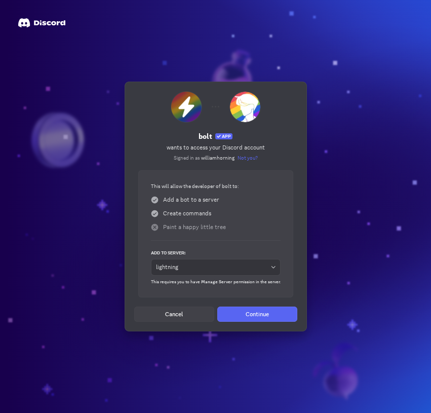
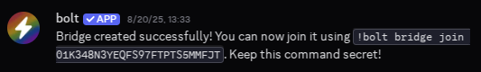
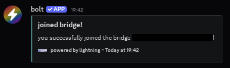

+++
title = "Getting Started · Users · Bridge · Lightning · Jersey"
description = "setup a bridge with Lightning: a cross-platform bot"
image = "lightning-opengraph.png"
icon = "lightning.png"
+++

# getting started with Lightning

Hello! Lightning is a cross-platform bridge bot, letting you connect channels
between multiple platforms. If you've wound up here, you probably want to setup
a bridge. If not, use the help command to learn more about the bot. This guide
will use [Bolt](../../../bolt) as the instance of Lightning used, but if you're
using another instance, note that the prefix and invite links will differ. This
guide will also cover using the bot from Discord, but the steps are the same
for the other supported platforms.

## invite the bot

If you're using Bolt, you'll want to invite the bot using one of the following
links, but if n
ot, ask whoever is hosting the bot for you for a link.

- [Discord](/bolt/invite/discord)
- [Guilded](/bolt/invite/guilded)
- [Stoat](/bolt/invite/stoat)
- [Telegram](/bolt/invite/telegram)

## create a bridge

In the first channel you're trying to bridge, run `!bolt bridge create` once
you give the bot the necessary permissions. It should DM you a bridge ID,
which you should save for later. Note that you **MUST** keep your bridge ID a
secret! **ANYONE** who has your bridge ID can join your bridge.

## join a bridge

In every other channel you wish to bridge, run `!bolt bridge join ...`,
replacing the `...` with your bridge ID. The bot should DM you a message upon
success. Then, send a message to make sure it works.
