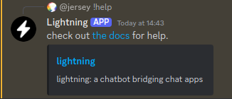
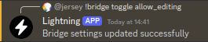

# Commands

Note that `!` may not be the prefix Lightning uses in your server

## help

| Usage | `!help` |
| ----- | ------- |

Displays help.

## ping

| Usage | `!ping` |
| ----- | ------- |

Displays the time it takes for the bot to respond to you.

## version

| Usage | `!version` |
| ----- | ---------- |

Displays the version of Lightning the bot runs.

## bridge

Command for managing bridges in the current channel.

### create

| Usage    | `!bridge create [name]` |
| -------- | ----------------------- |
| `[name]` | a name of your choice   |

Creates a bridge with the name provided, returns the ID of the bridge.

### join

| Usage  | `!bridge join [ID]` |
| ------ | ------------------- |
| `[ID]` | an ID of a bridge   |

Joins the bridge with the given ID.

### leave

| Usage | `!bridge leave` |
| ----- | --------------- |

Leaves the bridge in the current channel.

### toggle

| Usage       | `!bridge toggle [setting]`                              |
| ----------- | ------------------------------------------------------- |
| `[setting]` | one of `allow_editing`, `allow_everyone`, `use_rawname` |

Changes a setting on the bridge. See [_bridge settings_](settings.md)

### status

| Usage | `!bridge status` |
| ----- | ---------------- |

Displays information about the current bridge

