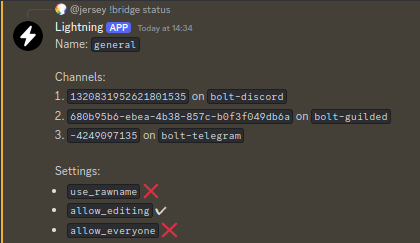

---
next:
  text: 'Bridge Settings'
  link: /users/settings
---

# Users Guide

Hello! Lightning is a chatbot which bridges channels between messaging apps. If
you've winded up here, you're probably wondering how to setup a bridge. If not,
you can find a [list of commands](commands.md) or list of
[bridge settings](settings.md)

## Step 1: Invite the bot

To use the bot, you have to invite it to your server. If you're using a version
of the bot hosted by someone, use the invite links provided by them. If you
don't have someone hosting the bot for you, you might want to take a look at
[bolt](https://williamhorning.eu.org/bolt). You have to invite the bot to all of
the messaging apps where you want to bridge messages.

## Step 2: Create a bridge

> [!CAUTION]
> Keep your bridge ID a secret! Anyone who has this ID can join your bridge

In the channel you're trying to bridge, you have to make a bridge. First, you
would choose a name, and then you would run the `!bridge create [name]` command.
After that, take note of the ID so that you can use it later.

## Step 3: Join the bridge

In every channel you wish to bridge, run the `!bridge join [id]` command, using
the ID from when the bridge was created.

## Step 4: Verifying everything works

Once you ran the join command in every channel you wish to be bridged, run the
`!bridge status` command to ensure everything is all set.

