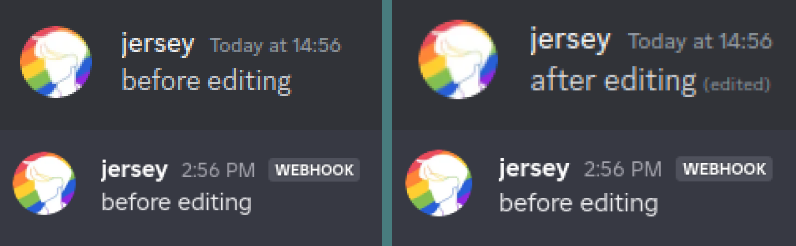
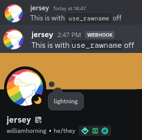

# Bridge Settings

Settings are a way to change certain ways lightning works. As of right now,
there are only the following settings:

[[TOC]]

To see if a setting is on, use `!bridge status`\
To toggle a setting, use `!bridge toggle [setting]`

## `allow_editing`

This setting allows you to decide whether to bridge the editing/deletion of
messages.

| on (default)                     | off                                |
| -------------------------------- | ---------------------------------- |
|  |  |

## `allow_everyone`

This setting allows you to decide whether to bridge mass-pings (such as
@everyone or @here)

| on (default)                      | off                                 |
| --------------------------------- | ----------------------------------- |
|  |  |

## `use_rawname`

This setting allows you to decide whether to bridge nicknames or not

| on                               | off (default)                      |
| -------------------------------- | ---------------------------------- |
|  |  |
