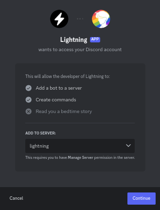

# 0.7.x Users Guide

Hello! Lightning is a chatbot which bridges channels between messaging apps. If
you've winded up here, you're probably wondering how to setup a bridge. If not,
you can find a [list of commands](./seven/commands). If you're using 0.8.0, see the
[0.8.0 guide](../users).

## Step 1: Invite the bot

To use the bot, you have to invite it to your server. If you're using a version
of the bot hosted by someone, use the invite links provided by them. If you
don't have someone hosting the bot for you, you might want to take a look at
[bolt](/bolt). You have to invite the bot to all of the messaging apps where you
want to bridge messages.

## Step 2: Join a bridge

Note that `!` may not be the prefix Lightning uses in your server. if you use
bolt, the prefix is `!bolt`. If you are using a custom prefix, replace `!` with
your prefix.

In every channel you wish to bridge, run the `!bridge join --name=[id]` command,
using the ID from when the bridge was created.

## Step 3: Verifying everything works

Once you ran the join command in every channel you wish to be bridged, run the
`!bridge status` command to ensure everything is all set.

