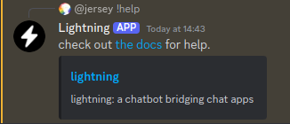
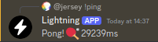
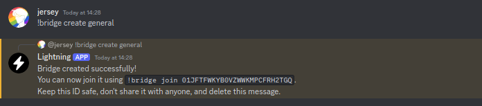
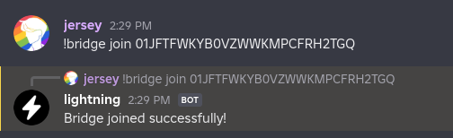
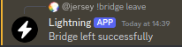
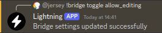
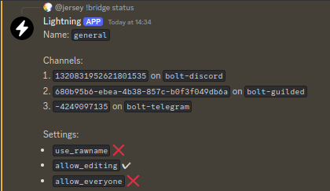

# Commands

Note that `!` may not be the prefix Lightning uses in your server. if you use
bolt, the prefix is `!bolt `. If you are using a custom prefix, replace `!` with
your prefix.

## help

| Usage | `!help` |
| ----- | ------- |

Displays help.

## ping

| Usage | `!ping` |
| ----- | ------- |

Displays the time it takes for the bot to respond to you.

## bridge

Command for managing bridges in the current channel.

### create

| Usage    | `!bridge create [name]` |
| -------- | ----------------------- |
| `[name]` | a name of your choice   |

Creates a bridge with the name provided, returns the ID of the bridge.

### join

| Usage  | `!bridge join [ID]` |
| ------ | ------------------- |
| `[ID]` | an ID of a bridge   |

Joins the bridge with the given ID.

### subscribe

| Usage  | `!bridge subscribe [id]` |
| ------ | ------------------------ |
| `[ID]` | an id of a bridge        |

Subscribes to the bridge with the given ID.

### leave

| Usage  | `!bridge leave [id]`         |
| ------ | ---------------------------- |
| `[id]` | the ID of the current bridge |

Leaves the bridge in the current channel if given an id.

### toggle

| Usage       | `!bridge toggle [setting]` |
| ----------- | -------------------------- |
| `[setting]` | one of `allow_everyone`    |

Changes a setting on the bridge. See [_bridge settings_](../settings)

### status

| Usage | `!bridge status` |
| ----- | ---------------- |

Displays information about the current bridge

